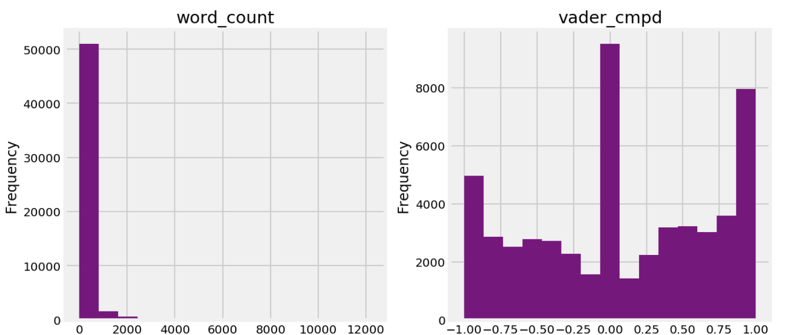
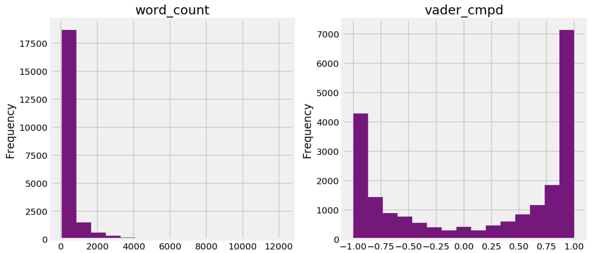
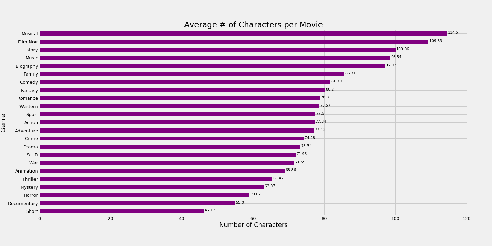

# Technical Report: Movie Character Recommendation System
---

## Problem Statement:
---
Recommendation systems are ubiquitous in our Internet connected world and can benefit both consumers and businesses. For example, TV streaming services, such as Netflix and Hulu, attempt to cater towards their userbase by customizing video playlists based on their userbase's preferences, ratings, and viewing patterns. As a result, companies are able to increase user engagement, while users are more likely to be entertained and loyal to their respective streaming services. In this project, I will create a movie character recommendation system by using a cosine similarity metric to compare the quotes and dialogues of various movie characters from over 1000 movies. The objective is to utilize natural language processing (TF-IDF), semantic analysis (VADER), and neural networks (Doc2Vec) to produce a viable content-based recommendation system in which a user can select a movie character and receive the top 10 most similar movie characters based on the similarities of the words spoken between the selected character and the recommended characters.

## Data Collection:
---
I gathered two datasets, txt. files from the [Cornell Movie Dialogs Corpus](https://www.cs.cornell.edu/~cristian/Cornell_Movie-Dialogs_Corpus.html) and csv. files from the [Cornell Movie Quotes Corpus](http://www.cs.cornell.edu/~cristian/memorability.html). Both datasets contain information about the movie title, the characters, genres, and each characters' movie lines. Since the majority of the datasets' movie titles and genres were either corrupted or missing, I created web scraping function that scraped IMDb's site to gather each movie's official title, genres, IMDb url, and a picture url.

## Exploratory Data Analysis:
---
Different trends in the genre, character word count, and sentiment scores within the `mov_combo_final` dataset were examined. The dataset contains over 11 million words, and histograms were used to examine the skew of the total word count distribution among movie characters as well as the sentiment score.

The first set of histograms displays the count of characters who have a word count above 10 words. Based on the high frequency of low word counts, the associated VADER sentiment score is 0 which is completely neutral. A neutral sentiment score most likely derives from short movie lines in which there are not enough words to express one's sentiment.

As soon as the word count per character increases to over 50 words, the VADER sentiment scores become more binarized, where -1 captures negative sentiment and +1 captures positive sentiment. 

The following barplot examines each genre's average number of characters per movie. Based on the dataset, many movies have a high number of characters, which may have an influence on the words spoken among major and minor characters. 

Furthermore, TF-IDF was utilized to examine the top most important words for each genre. The purpose is to gain a deeper understanding of how the characters' texts could potentially have predictive values based on genre-specific words in its similarities with one another.

## Modeling:
---
The character recommendation system was created by using gensim's Doc2Vec's Distributed Memory version of Paragraph Vector (PV-DM) model to calculate the cosine similarity between a selected character's movie lines to other characters' movie lines.

[Doc2Vec](https://medium.com/scaleabout/a-gentle-introduction-to-doc2vec-db3e8c0cce5e) is a neural network that utilizes Word2Vec and a paragraph matrix (aka document vector). It is an unsupervised model that can be trained to learn document representation. In essence, it uses Word2Vec's two algorithms, continuous bag of words (CBOW) and skip gram. The CBOW is an algorithm that scans the context of surrounding words in a text to predict a word, whereas the skip gram uses a single word to predict the context of all surrounding words. While the CBOW algorithm is useful for obtaining a better accuracy for frequently used words, the skip gram is useful for dealing with uncommon words when dealing with training data. Word2Vec will be used to predict the concept of a word, and Doc2Vec supplements Word2Vec by acting as a memory that is trained to represent the concept/topic of a document.

The beauty of Doc2Vec is that the input of words per document for the neural network is not fixed, but the output has fixed vector sizes. This is great because of the large variability of the number of words used for each movie character.

In our particular case, each character's total movie lines will be synonymous to a document. Based on the `mov_model` dataframe, there are 76127 documents (movie lines) that were processed.

## Recommender System:
---
I created a function that allows the user to choose a movie character of their choice by providing the option of filtering through the `mov_info` dataset. In sequential order, the user can choose a movie and the character, and then the function will recommend the top 10 most similar movie characters. The user can pick 1 of out of 10 recommended characters to examine their text and what movie they are from.

You can examine a few examples in the [Recommender System](https://github.com/dansthemanwhosakid/capstone/blob/master/notebooks/05_Recommendation%20System.ipynb) notebook.

## Future Steps:
---
Obviously, the model is in its infantile state and there is much room for improvement. Collecting more movie character dialogue and quotes would be beneficial as it can train the Doc2Vec model more. 

**Issues:** Though the data was acquired through two corporas, a few of the character lines are actually action and scene cues in a script. Non-quote and dialogue sentences may drastically affect the model's predictive abilities. 

**Additional Models:** Furthermore, a different statistical model, such as a Latent Dirichlet Allocation, can be used to explain why some documents are more similar to one another by allowing observations to be explained by unobserved groups. By setting each movie character's genres as a topic tag, perhaps an LDA model be used to classify the movie characters based on their words and what genre they are categorized in.